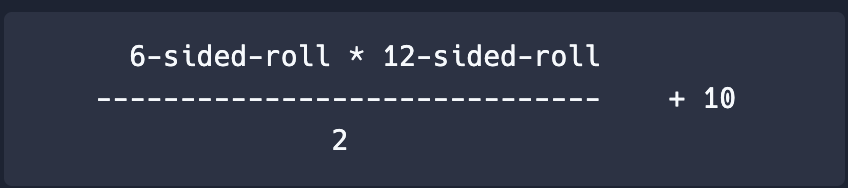
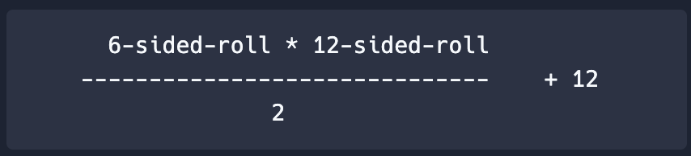

# 👉 Day 27 Challenge

Welcome to your first video game creation. You will create a video game that creates a character's health and attack stats...along with an epic name for your character.

**Do not delete today's code. You will be building upon it on Day 28.**

- Write a subroutine that generates a character: first name and character type (human, imp, wizard, elf, etc.).
- Write a subroutine that multiplies a bunch of random dice rolls together to generate the character's health stats. Use this formula:



- Write a second subroutine that multiplies a bunch of random dice rolls together to generate the character's strength stats. Use this formula:




- Present the data in a menu with `time.sleep` and `os.system("clear")` to make it appealing.
- Wrap it in a loop so the user has the option to create another character.

Example:
```
Character Builder

Name Your Legend:
Sheila the Almighty

Character Type (Human, Elf, Wiard, Orc):
Human

Sheila the Almighty
HEALTH: 40
STRENGTH: 26

May your name go down in Legend...
```

<details> <summary> 💡 Hints </summary>

- Import libraries first. You will need to use all three libraries you have learned so far.
- You will need four subroutines: character name and type, to create a random sided dice, for the formula to generate health, and for the formula to generate strength. You will `return` each subroutine.
- Create a `while` loop that allows the player to choose to play again, clears the code, and pauses it when needed (think about your libraries).


</details>